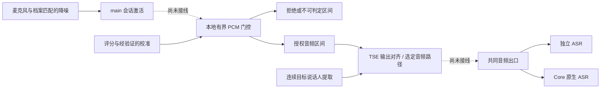

# 会话激活后的 ASR 前音频拦截

> **状态：研发目标与基础实现记录，尚未生产接线。** #2980 的目标是在 main 的会话激活机制之上，持续拦截旁人音频，使其不进入 ASR。当前门控、调度、区间账本和 TSE 对齐模块可独立测试；应用尚未启用此功能。

## 目标与当前差距

main 的会话激活负责 WAITING / VERIFYING 阶段的本地缓存、本人确认和一次性回放；进入 ACTIVE 后继续放行音频。#2980 要增加的是 ACTIVE 期间、ASR 接收音频之前的持续判断。一次激活不能为后续旁人语音授权；ASR 已收到音频之后再丢弃 partial/final，也不满足该目标。

| 层次 | 本分支状态 | 能证明什么 |
| --- | --- | --- |
| main 会话激活、四段录入及档案合同 | 沿用现有生产实现 | 会话激活与 ASR 开关继续正交；不是持续说话人过滤。 |
| `voice_identity_service.prewire_gate` | 恢复的研发基础 | 本地保留 PCM，按版本及原始区间判定；只对 KEEP 形成音频释放计划，拒绝或证据不足形成显式 gap。 |
| 有界评分调度与区间账本 | 恢复的研发基础 | 排队、期限、取消、迟到结果和交付阶段可独立验证；不证明分类器准确。 |
| pVAD / ECAPA、离线校准 | 模型与校准基础 | 可评估短语音的活动和身份证据；没有获得生产放行权限的校准包。 |
| TSE worker 与 `PrewireExtractionAdapter` | 连续流及对齐基础 | 只输出授权区间对应的分离结果，缺少分离结果不回退原始音频；不证明真实多人分离效果。 |
| 激活输出到门控、门控到两个 ASR 路由 | **未实现** | 当前运行应用仍会在 ACTIVE 期间放行后续音频，不能宣称已拦截旁人。 |

模型与工具入口见[配套模型与诊断说明](/design/optional-voice-model-tools)。历史 ASR 日志检查器只读旧事件，不是当前门控的线上观测能力。

## 目标架构与依赖

门控位于 `main_logic/voice_identity_service/prewire_gate`，不依赖某个 Provider 的 started、endpoint 或 final。它也不导入 Core、生产 activation runtime 或 TSE 模型；Core 负责组装，模型和校准通过显式接口提供证据。纯 `voice_identity` 领域层不反向依赖服务实现。

当前共同输出边界是 `AsrRuntimeMixin._route_voice_session_activation_output`，其下游 `_route_microphone_audio_unfiltered` 分发到独立 ASR 或 native ASR。后续接线需要在首次可能交付到 ASR 之前安置门控，并继续使用现有 generation 和交付身份检查，不能只修改独立 ASR 的 transcript 回调。

## 已恢复的门控合同

- PCM 使用本地连续的 16 kHz 原始采样轴；scoring / decision / commit 区间分开。网络 chunk 大小不能充当说话人边界，拒绝区间也不能被无记录地拼接。
- `PrewireIntervalIdentity` 绑定 session、ingress、profile、model、config 与原始范围。异步结果必须仍属于提交时的实例，旧请求不能授权新流。
- 仅 KEEP 生成 `PrewireAudioEvent`。DROP、UNCERTAIN、UNAVAILABLE、STALE 生成无 PCM 的 gap；缺少校准、模型失败或超时不能自动放行。
- 释放计划不是发送回执。`claim` 只在调用方确认本地入队后推进 ENQUEUED；后续 WRITTEN / REMOTE_CONFIRMED / UNKNOWN 由持有同一账本的交付 owner 记录。未知交付不能重放。
- 账本不能淘汰尚在交付或远端状态不明的记录；容量耗尽必须显式失败。评分线程无法强制终止，生产 scorer 必须自己拥有可终止的进程及退休协议，调度器的有界返回不代表 native 资源已退出。
- TSE 对齐独立保留原始轴与 ASR 轴。TSE 结果不是身份授权；门控授权也不允许在 TSE 缺失时回退原始混合音频。
- 保留的实验策略可将可信本地边界内、已经结束且独立的不足 200 ms 事件直接丢弃；这不是声纹识别结论，会损失主人的短词，不能不经效果验收就作为生产策略。该规则不能用于未结束的 chunk。

## 调度与尾音的收尾合同

评分回执的消费归属与后端执行生命周期分开。`cancel` 保留可读取的取消结果；当门控撤销流、部分提交失败或提前结束判定后，不再有结果消费者时，必须 `abandon` 回执，同时释放队列节点、计时器及逻辑容量。已开始等待的消费者仍能拿到其结果，迟到结果不能复活旧区间。同步推理线程可能继续持有当前音频，调度器仍须等它实际返回后才启动下一次推理；逻辑缓存归零不代表该线程已释放资源。

排队任务从首次入队起独立计时，即使前一个同步推理已经超时却没有返回，后续任务也会按时得到超时结果。超时不会放行音频，也不会绕过单通道串行约束。

本地事件结束时，剩余尾音被拆成不超过提交步长的连续区间。尾音保留真实样本长度，只有评分计划明确支持该长度时才送入模型；否则形成 `scoring_window_unsupported` 的 UNAVAILABLE gap，收尾保留这一原因。该行为可能丢弃主人的尾音，需要后续真实数据校准短窗口；不能补零、借用前一窗口的本人证据或默认 KEEP。

实时窗口的 guard 位于 decision 内、commit 之后，scoring 包含整个 decision。因此 `window >= step + guard` 的合法配置可直接使用规划器输出，不重复计算 guard；不足 guard 的实时区间仍被拒绝。

## 完成生产接线的必要工作

1. 明确本地语音事件和短词策略，并以真实旁人、主人短词、轮流说话及重叠语音验证。现有 CAM++ 的 0.40 激活阈值不能直接当成每帧上传授权阈值；pVAD 活动值也不是身份概率。混合音频里检测到主人不代表旁人已被移除。
2. 形成与录入参考、模型版本及前处理匹配的校准与资源装配。ECAPA / TSE 参考不能由当前 CAM++ 向量替代；TSE 固定发行清单尚无下载源，真实模型验收未完成。
3. 给 activation 输出与门控之间的缓存、回放、暂停、idle 和撤权建立单一 owner。`LOCAL_ACCEPTED` 只代表本地承接，不能冒充音频已进入 ASR；被阻断的帧也不能按 `NOT_SENT` 触发原音重试。唤醒和首次回放不得成为持续门控的旁路。
4. 对独立 ASR 与 native ASR 成对接线；在 profile / route / permission 切换、取消、断线和队列溢出时退休旧流。gap 必须被下游显式处理，不能把两段不连续音频伪造成一段连续语音。
5. 用 ASR 接收端实际收到的 PCM 验收：旁人片段不出现，允许的主人片段按原顺序出现一次；模型不可用时无原音旁路，恢复后的新会话不受旧任务影响。另需测量真实延迟、CPU / 内存和 Web / Electron 行为。

这些是目标完成的条件，当前独立模块测试不替代上述验收。研发期间保持 Draft；原来的 Provider exact 转写裁决、旧 Admission / `asr_composition` 和 schema 4/5 不恢复为生产依赖。
