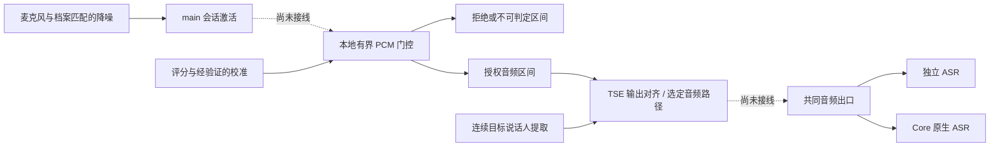

# 会话激活后的 ASR 前音频拦截

> **状态：研发目标与基础实现记录，尚未生产接线。** #2980 的目标是在 main 的会话激活机制之上，持续拦截旁人音频，使其不进入 ASR。当前门控、调度、区间账本和 TSE 对齐模块可独立测试；应用尚未启用此功能。

## 目标与当前差距

main 的会话激活负责 WAITING / VERIFYING 阶段的本地缓存、本人确认和一次性回放；进入 ACTIVE 后继续放行音频。#2980 要增加的是 ACTIVE 期间、ASR 接收音频之前的持续判断。一次激活不能为后续旁人语音授权；ASR 已收到音频之后再丢弃 partial/final，也不满足该目标。

| 层次 | 本分支状态 | 能证明什么 |
| --- | --- | --- |
| main 会话激活、四段录入及档案合同 | 沿用现有生产实现 | 会话激活与 ASR 开关继续正交；不是持续说话人过滤。 |
| `voice_identity_service.prewire_gate` | 恢复的研发基础 | 本地保留 PCM，按版本及原始区间判定；只对 KEEP 形成音频释放计划，拒绝或证据不足形成显式 gap。 |
| 有界评分调度与区间账本 | 恢复的研发基础 | 排队、期限、取消、迟到结果和交付阶段可独立验证；不证明分类器准确。 |
| pVAD / ECAPA、离线校准 | 模型与校准基础 | 可评估短语音的活动和身份证据；没有获得生产放行权限的校准包。 |
| TSE worker 与 `PrewireExtractionAdapter` | 连续流及对齐基础 | 只输出授权区间对应的分离结果，缺少分离结果不回退原始音频；不证明真实多人分离效果。 |
| 激活输出到门控、门控到两个 ASR 路由 | 注入式桥接接口已实现，**生产未装配** | 注入模型替身的回归可验证两个接收端的 PCM；当前运行应用仍会在 ACTIVE 期间放行后续音频，不能宣称已拦截旁人。 |

模型与工具入口见[配套模型与诊断说明](optional-voice-model-tools.md)。历史 ASR 日志检查器只读旧事件，不是当前门控的线上观测能力。

## 目标架构与依赖

门控位于 `main_logic/voice_identity_service/prewire_gate`，不依赖某个 Provider 的 started、endpoint 或 final。它也不导入 Core、生产 activation runtime 或 TSE 模型；Core 负责组装，模型和校准通过显式接口提供证据。纯 `voice_identity` 领域层不反向依赖服务实现。

当前共同输出边界是 `AsrRuntimeMixin._route_voice_session_activation_output`，其下游 `_route_microphone_audio_unfiltered` 分发到独立 ASR 或 native ASR。后续接线需要在首次可能交付到 ASR 之前安置门控，并继续使用现有 generation 和交付身份检查，不能只修改独立 ASR 的 transcript 回调。

## 已恢复的门控合同

- PCM 使用本地连续的 16 kHz 原始采样轴；scoring / decision / commit 区间分开。网络 chunk 大小不能充当说话人边界，拒绝区间也不能被无记录地拼接。
- `PrewireIntervalIdentity` 绑定 session、ingress、profile、model、config 与原始范围。异步结果必须仍属于提交时的实例，旧请求不能授权新流。
- 仅 KEEP 生成 `PrewireAudioEvent`。DROP、UNCERTAIN、UNAVAILABLE、STALE 生成无 PCM 的 gap；缺少校准、模型失败或超时不能自动放行。
- 释放计划不是发送回执。`claim` 只在调用方确认本地入队后推进 ENQUEUED；交付 owner 通过 `advance_delivery` 按真实证据推进 WRITTEN / REMOTE_CONFIRMED / UNKNOWN，门控默认创建的账本也支持这一入口。流或门控关闭后仍可确认原身份的交付，未知交付不能重放。
- 组合运行时尚未返回的区间仍由本地持有：未连续确认的 OWNER 前缀、等待提取的区间和已排入待返回批次的 PCM 共用有界容量。gap、失败、取消和 teardown 通过 `cancel_local_delivery` 将这些已 claim 且从未交出的区间 CAS 到 LOCAL_CANCELLED，允许安全淘汰；身份、评分结论及预留映射不改写，游标不回退。已经返回的区间继续保持 ENQUEUED，关闭不能冒充远端确认或撤销。
- 账本不能淘汰尚在交付或远端状态不明的记录；容量耗尽必须显式失败。评分线程无法强制终止，生产 scorer 必须自己拥有可终止的进程及退休协议，调度器的有界返回不代表 native 资源已退出。
- TSE 对齐独立保留原始轴与 ASR 轴。TSE 结果不是身份授权；门控授权也不允许在 TSE 缺失时回退原始混合音频。
- 保留的实验策略可将可信本地边界内、已经结束且独立的不足 200 ms 事件直接丢弃；这不是声纹识别结论，会损失主人的短词，不能不经效果验收就作为生产策略。该规则不能用于未结束的 chunk。

## 调度与尾音的收尾合同

组合运行时按 gate 区间身份维护一条有界 FIFO，同时等待连续 OWNER 确认与对应 TSE PCM。两种输入先后到达都不改变原始区间顺序；gap 只撤销尚未确认的 OWNER 前缀，迟到的提取结果不能恢复已撤销区间。finish 先接收 TSE flush，再释放已确认前缀；不支持的尾窗口仍形成 gap，不能抹掉此前已确认的音频，也不能借前缀证据放行尾音。待释放 PCM 和区间数分别计入容量上限，关闭时释放本地缓冲。

工厂从创建 runtime 起预留资源槽，只有关闭且确认物理退休后才能替换。Core 的工厂替换、撤权和路由失效共享退役归属：先同步阻断旧输出，再有界等待；等待超时或等待者取消不取消底层清理。失败时保留原 bridge/runtime，下次请求重试同一对象，确认退出后才安装新对象；跨 await 的旧请求不得覆盖新请求的策略。应用撤权同时清除成功安装缓存，即使再次提交同一工厂也须重装。工厂只移除已退役资源的引用，不清空交付 owner 仍持有的 gate/ledger。

应用安装缓存绑定中立的 `InterceptionInstallation` 尝试身份。Core setter 接收该回执，在同步失效后通知应用；只有实际安装成功且回执仍有效才能报告 READY。路由、静音和焦点等临时失效复用应用现有有界 watchdog，在旧对象物理退出后重装当前授权工厂。激活撤权、档案变化、显式撤权和关闭不触发旧授权恢复；旧回执不能影响新安装。模型缺失保持 degraded 且不空转重试；功能关闭时不创建模型或恢复任务。Core 不保存领域工厂以自行恢复。

评分回执的消费归属与后端执行生命周期分开。`cancel` 保留可读取的取消结果；当门控撤销流、部分提交失败或提前结束判定后，不再有结果消费者时，必须 `abandon` 回执，同时释放队列节点、计时器及逻辑容量。已开始等待的消费者仍能拿到其结果，迟到结果不能复活旧区间。同步推理线程可能继续持有当前音频，调度器仍须等它实际返回后才启动下一次推理；逻辑缓存归零不代表该线程已释放资源。

排队任务从首次入队起独立计时，即使前一个同步推理已经超时却没有返回，后续任务也会按时得到超时结果。超时不会放行音频，也不会绕过单通道串行约束。

活跃任务在发布分数前再次核对原始绝对期限。即使事件循环延迟导致超时与完成事件同时可处理，到达或超过期限的结果也只返回 TIMED_OUT，不携带可用于放行的分数；已实际完成的调用不影响后续任务继续串行执行。

本地事件结束时，剩余尾音被拆成不超过提交步长的连续区间。尾音保留真实样本长度，只有评分计划明确支持该长度时才送入模型；否则形成 `scoring_window_unsupported` 的 UNAVAILABLE gap，收尾保留这一原因。这个已知的终端长度限制可以结束为缺口；实时评分异常、超时和模型故障则立即返回不可用并退休本轮运行时，不能一直伪装成等待。该行为可能丢弃主人的尾音，需要后续真实数据校准短窗口；不能补零、借用前一窗口的本人证据或默认 KEEP。

采集结束仅设置 `event_ended`。规划器切出的尾区间没有经过独立事件与边界可信度验证，因此 `boundary_trusted` 和 `independent_event` 均为 false，不能套用可信独立事件的不足 200 ms 规则。这一修正不会扩大短尾音的放行权限。

实时窗口的 guard 位于 decision 内、commit 之后，scoring 包含整个 decision。因此 `window >= step + guard` 的合法配置可直接使用规划器输出，不重复计算 guard；不足 guard 的实时区间仍被拒绝。

连续运行时取得完整的 UNCERTAIN 结论后，显式将该区间的音频处置结算为缺口。身份仍为 UNCERTAIN，原分数、版本、原因及 endpoint 不改写；未完成评分、旧代次和已交付区间不能进入该转换。缺口结算不可逆，后来评分不能升级它为 KEEP。这个转换推动连续游标，使后续满足确认条件的本人区间能够继续处理；独立使用 Gate 的调用方仍须显式请求结算。

正常 `finish()` 与外部关闭使用不同的输出权限。正常结束可以保留已经确认且取得提取结果的待返回前缀；关闭、撤权、取消及故障先不可逆地撤销尚未交出的输出，再启动有界清理。内部收尾和公开 `finish()` 的最后返回边界都重新检查撤销状态，内部任务已经构造结果不代表已经交接。重复结束不重复交出 PCM。只有已证明仍由本地持有的区间可以进入 LOCAL_CANCELLED；先前成功返回的批次保留真实交付债。

收尾使用一个单调时钟总期限，包含等锁、flush、评分、逐份计划结算和清理等待。Gate 返回计划时先接纳并 claim，再继续获取下一份，直到真实 End；每轮必须推动原始游标前进，并受次数和剩余时间约束。调用方等待超时或取消时，运行时继续持有底层执行及清理任务；这些任务可以晚完成，但不得恢复旧输出权限。

`capture_support_timeout_seconds` 是采样支持预算：未显式配置时，按 `(window_samples + (owner_streak_required - 1) * step_samples) / 16000` 推导最低所需支持，显式值不能小于它。`prefix_deadline_seconds` 是额外的处理和抖动预算；这明确改变了此前把它当作整个采集期限的解释。默认 900ms 窗口和两次确认、150ms 步长的支持时长为 1.05s，再加默认 1s 处理预算；它们不等于模型推理耗时，也不表示通过新增等待 300ms／500ms 的设备目标。1.5s 窗口对应至少 1.65s 音频支持，需要另验模型能力、容量和整链路延迟。

等待期限绑定最早尚未结算的真实音频区间，新 PCM 不得不断延长旧身份或提取结果的等待。采样位置负责排序，墙钟仅作为到达时的输入年龄观测，期限使用单调时钟。窗口、步长、guard、确认次数、缓存及有限正数期限在创建工厂时验证；明确声明的模型能力还须与实际窗口、16kHz 采样率和模型版本一致。能力声明不是校准，更不授权生产放行。

评分及运行时容量包含真正仍在执行的工作。消费取消回执、abandon 逻辑任务或清空队列，不释放仍持有 PCM 的底层执行槽。同步评分线程退出后才销账；取消的异步包装若委托线程或进程，必须由后端 owner 明确证明物理退出。正常返回也必须尊重后端、质量分析器和 TSE 显式声明的退出证据；非 True、读取异常和动态声明均不能冒充物理退出。没有取消且没有这类声明的旧组件仍以正常 awaited 返回兼容。没有该证据时保留未确认退休状态，不能依据外层 Task 已取消允许接管。启动、质量分析、提取和 flush 的未完成任务同样纳入运行时退休检查。

工厂可以公开只读布尔 `is_available`，表示配置已验证且授权尚未退休。Core 在发布安装回执前拒绝明确不可用的工厂，不为检查分配模型；旧注入工厂没有这个声明仍按现有接口安装。因此安装成功只证明桥接和已声明前置条件成立，不能替代首次运行时创建与实际模型启动验收。档案切换仍关闭旧工厂，不能通过删除关闭操作恢复旧授权。

应用注册先完成 Owner required policy、录入抑制和 activation 挂接，再安装持续拦截工厂。拦截未就绪不允许跳过这些独立策略；首次等待前先关闭原音出口。注册和挂接 watchdog 只可补装本操作开始时有效、随后被自身 activation 准备撤销的确切回执，并重新核对当前工厂、注册表授权版本及 Core policy token。操作开始前已撤销的回执、跨等待的新撤权和退休工厂都不能成为恢复授权。

`activate()` 每次重应用都退休旧持续拦截工厂，包括同档案、同 generation 和 `allow_partial`；同一档案标识不能证明 DSP、权限和资源绑定未变。注入方须在 activation 准备完成后显式发布匹配当前授权的新工厂，未发布时保持 degraded。当前生产资源装配仍未实现，此合同不承诺自动重新发布，也不能拿已经退休的工厂重试。

内部故障可以终止当前采集而不撤销仍有效的工厂授权。Bridge 只在真实 runtime 明确声明 `is_closed=True` 时，于后续新输入重试退休；物理退出确认后才创建新的采集实例。普通 UNAVAILABLE 不触发盲目重建，失败或交付未知的旧音频不重投。每个新采集使用独立 ingress 身份；迟到结果、异常、超时和取消核对具体 runtime，不能只凭相同 generation 破坏接管者。

共享工厂的含义是由应用统一拥有并串行交接，不表示并发采集能力。`PrewireInterceptionFactory` 维持一个物理 runtime 槽；另一个 manager 在槽被占用或退休未确认时显式不可用，确认退出后才可接管。本 PR 不建立多 manager 资源池，也不假定整个产品永远只有一个 manager。

activation 的唯一输出 writer 从已 claim 的 lease 显式传递 LIVE / REPLAY 来源，保留帧的原采集时间、样本位置及路由 context。当前、有界 activation lease 的 REPLAY 在持续拦截接纳时开始处理预算；LIVE 继续检查原输入年龄。两者使用相同的有限支持与处理预算，持续输入不能延长最早未结算区间的期限。回放仍须经过真实门控和提取，REPLAY 来源本身不授权 KEEP，也不能恢复旧代次输出。

每个流同时只持有一份尚未 claim 的计划。后续 resolver 返回同一计划，调用方须按计划身份去重交付，并在成功 claim 后获取下一份。账本 CAS 校验已选前缀、游标和映射；其他流或后续区间的评分不会让该前缀失效。前缀决策变化、重复 claim、伪造结束游标仍被拒绝。若等待发送时流身份已失效，调用方必须退休不安全的发送会话，不能把 claim 失败当成未发送而盲目重投。

账本保留已见过的 stream 身份作为防重放依据，身份数量上限与记录容量相同（默认 128）。本对象用于一个有界的交付生命周期；上限耗尽时以 `PrewireGateCapacityError` 拒绝新增流或记录。应用 owner 必须先退休旧音频路由，在保留旧账本处理尚未确认的交付的前提下，为新的生命周期创建 gate / ledger，不能把同一个 gate 当成无限重连的进程级单例。不会通过删除 UNKNOWN / ENQUEUED 记录来释放容量。

TSE 和 ECAPA 的进程启动共用服务层的显式归属辅助模块。启动超时或取消时若原生启动尚未返回，会抛出携带 `retirement_owner` 与 `retirement_task` 的退休中异常；后台 daemon owner 等待迟到句柄并终止进程。取消等待者不取消物理清理，TSE 参考音频副本由该 owner 保留至启动结束并清理。请求在有界时间内返回，并不表示原生进程已停止；调用方必须等到 `confirmed_stopped` 成立后，才能允许替代录入。管道 EOF/OS 错误归类为模型 worker 失败，进程退出后再次检查管道，避免丢失刚刚到达的结果。

ECAPA 已启动进程的终止失败，以及部分启动失败后的清理失败，也必须交出显式退休 owner 并保留进程与接收管道。历史异常类名 `EcapaStartupRetirementError` 保留兼容，其归属合同覆盖上述路径；只有后台确认物理退出并关闭句柄后，才解封替代录入。清理失败不能被当成普通启动错误而直接确认已停止。

## 完成生产接线的必要工作

1. 明确本地语音事件和短词策略，并以真实旁人、主人短词、轮流说话及重叠语音验证。现有 CAM++ 的 0.40 激活阈值不能直接当成每帧上传授权阈值；pVAD 活动值也不是身份概率。混合音频里检测到主人不代表旁人已被移除。
2. 形成与录入参考、模型版本及前处理匹配的校准与资源装配。ECAPA / TSE 参考不能由当前 CAM++ 向量替代；TSE 固定发行清单尚无下载源，真实模型验收未完成。
3. 给 activation 输出与门控之间的缓存、回放、暂停、idle 和撤权建立单一 owner。`LOCAL_ACCEPTED` 只代表本地承接，不能冒充音频已进入 ASR；被阻断的帧也不能按 `NOT_SENT` 触发原音重试。唤醒和首次回放不得成为持续门控的旁路。
4. 对独立 ASR 与 native ASR 成对接线；在 profile / route / permission 切换、取消、断线和队列溢出时退休旧流。gap 必须被下游显式处理，不能把两段不连续音频伪造成一段连续语音。
5. 用 ASR 接收端实际收到的 PCM 验收：旁人片段不出现，允许的主人片段按原顺序出现一次；模型不可用时无原音旁路，恢复后的新会话不受旧任务影响。另需测量真实延迟、CPU / 内存和 Web / Electron 行为。

这些是目标完成的条件，当前独立模块测试不替代上述验收。生产工厂继续关闭，PR 的 ready／Draft 状态不代表已经通过生产准入；原来的 Provider exact 转写裁决、旧 Admission / `asr_composition` 和 schema 4/5 不恢复为生产依赖。

#3371 在本基础之上实现提取音频／分离音轨的输出声纹检查、共同 ASR 出口和交付回执。输出声纹通过只能证明身份证据，不证明旁人词汇没有残留。native、Provider VAD 和缺少精确源映射的重采样路线仍需单独准入；本基础的两个模拟接收端回归不能代替这些生产路线的验收。基础更新后须显式同步堆叠 PR，保留其输出和交付合同并重新跑组合回归。

## 2026-10-10 可靠性修复验证

本轮从固定的 #2980 基础 `f9a0f36db` 建立干净隔离工作树，保留原工作树的未提交内容。三个代码提交分别处理区间和评分归属、有界收尾及输出撤销、不可用工厂的安装回执；核心代码版本为 `315294515`。

Windows 相关完整回归为 **2568 passed、11 skipped**，六个修改源码模块总体语句覆盖率 **90.29%**，运行时模块约 97%。覆盖区间账本、真实线程及取消包装、延迟提取、关闭与公开返回交错、合法配置下容量耗尽、Core 和应用注册表。600 个项目模块来源审计没有越界源码。关键区间、评分、容量、物理退休和最终返回护栏的隔离源码变异均被对应反例发现；中断或失败批次未计入通过数字。

同一代码与目标 main `15bdcc893` 无冲突合并后的隔离集成回归为 **2585 passed、11 skipped**，项目源码来源审计通过。Ruff、核心合同、模块分层、异步阻塞、启动导入及相关静态检查通过。提交前图变更检查覆盖 13 个路径、194 个符号，没有 partial/truncated；索引的全局执行流数量、深度和动态调用仍有缺口，零受影响流程不是安全证明，另外核对了桥接、注册表、输出消费者与受控回归。

以上证明当前本地流程与集成合同，不证明真实 ECAPA/TSE、真实 ASR、重叠讲话内容效果或最低设备性能。当前 head 的远端 CI 单独核对，不继承历史 head 的结果；生产工厂继续关闭，#3371 同步后仍须重新验证其输出声纹及真实交付边界。
