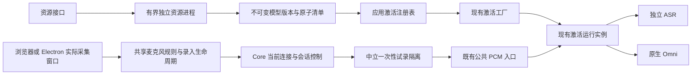

# 声纹实施：核心改动与审查边界

本次按采集修复、诊断预检、完整资源交付和激活恢复四个交付包实施。N.E.K.O 与 N.E.K.O.-PC 都从最新 main 建立独立 worktree；原工作区的已有改动保留。操作说明见 [声纹录入与语音激活修复](voice-readiness.md)。

## 核心改动、必要性与前后表现

| 改动 | 原行为及问题 | 实施后的行为 | 重点回归面 |
|---|---|---|---|
| `core/voice_readiness.py` 与中立的 `voice_input/preview.py` | 录入页无法证明关联主采集已停止，试录可能混入会话输入 | 实际采集窗口停止输入，后端退休并排空对应路径后发出一次性试录票据；公共 PCM 入口同时阻断其他生产者 | 停止、取消、超时、其他会话接管、JSON/二进制音频及排队输出 |
| `core/asr_runtime.py` 的小型组装与入口修改 | 缺少主输入和试录之间的统一隔离检查 | 复用原 ASR 和激活路由，仅增加隔离检查及目标会话控制入口 | 独立 ASR、原生 Omni、热切换、重放、队列与原生输出身份 |
| `voice_identity_service/resource_manager.py` 与服务公共入口 | 资源、采集质量和声纹匹配故障容易混为同一错误 | 资源准备和试录在正式录入前完成；有界独立进程执行模型准备及同一 DSP 链的质量检查 | 原生组件挂起、进程崩溃、取消、DSP 变化、45 秒录入时限和档案保护 |
| 激活工厂、应用注册表和唤醒资源发现 | 已安装缓存不能按启用偏好装配，资源错误可能被泛化 | 显式配置优先，启用后发现完整已校验缓存；已启用但资源异常保持阻断；资源修复更新工厂权威 | 权限与档案版本、准备失败、旧实例迟到及修复后重新准备 |
| 当前会话重试 | 不可用状态缺少目标明确的恢复入口 | 退休旧实例后重建；传输结果不确定的路径要求用户显式重启语音会话 | 不重投旧音频、不重用已退休 provider、输出失败和超时 |

声纹阈值、检查时机、48 kHz 单声道输入、16 kHz 后端链、三段参考加一段验证、45 秒总时限和档案格式均保持现有约定。新增正式录入请求字段是兼容扩展，用于核对已试录的 DSP 配置。

## 依赖与权威

模型包与偏好共用位于配置基础层的标准库文件锁；`main_logic` 不依赖应用入口，配置层不反向引用工具层。全仓模块分层检查作为守门保留。前端持续状态仅消费既有 `VOICE_SESSION_ACTIVATION_STATE`，恢复请求走既有 WebSocket 控制通道。IPC 只交换身份和操作结果，不传 PCM 或跨 partition 的设备编号。

## 新增资源的消费者

| 资源 | 发布、读取与清理边界 |
|---|---|
| 临时下载目录与标记 | 固定包安装器独占管理；固定来源、摘要、大小与解包白名单；中断后仅清理本功能明确拥有的临时目录 |
| `versions/<version>` | 完整校验和真实试加载后发布；运行实例继续使用原路径；不覆盖旧目录，最多三个版本并限制总占用 |
| `current.json` | 原子替换的完整版本指针；缓存发现和后端激活读取同一规则；取消或发布失败保留原有效指针 |
| `preference.pending`、偏好与锁 | 有界、串行、原子写入；下载不改启用偏好；不关联声纹档案保存 |
| 唤醒运行组件 | 固定源码与补丁构建，Windows x64 打包；冻结程序须通过真实模型加载检查后才可交付 |
| 修复指南、前端资源和测试 | 同源固定只读指南随冻结包交付；新增脚本由模板资产版本管理；八语缓存版本更新；Node 和 Electron 测试进入 CI |

缓存达到上限时停止安装并提示受控维护，避免删除仍在使用的旧版本。回退可以使用原显式模型路径，不改档案或启用偏好。

## 验证与实际限制

回归通过实际 WebSocket 入口和受控下游接收端验证独立 ASR／原生 Omni、JSON／二进制音频、等待／异常／试录期间的实际音频递交。Electron 验证使用实际模板、AudioWorklet、窗口、Session、桥接和更新面板；输入来自 Chromium 受控测试设备。

本机已用受控语音通过真实 CAM++、Silero 和 RNNoise 完成试录、三段参考加一段验证、成功保存及失败重录后的原档案保护。真实浏览器已验证资源准备和设备列表。该结果不替代实际物理麦克风、断插设备和不同声学环境的验收。

定稿后的联合 Python 回归为 1,939 项通过、4 项跳过；前端 Node 为 151 项通过，桌面采集控制为 18 项通过。三条实际 Electron 流程覆盖录入页面与 AudioWorklet、实际采集窗口和 Session 隔离、关于面板更新修复入口。八语提示、Node／Electron CI 入口、Ruff、异步阻塞和全仓模块分层检查均已核对。

新增模块按行覆盖率验收：Core 控制 90%、中立隔离 99%、唤醒资源发现 97%、错误白名单 100%、资源管理 85%、模型包交付 84%；前端共享采集 93.02%、试录与资源页面 84.46%、主会话状态与控制 83.86%。前端分支与函数覆盖低于行覆盖，Electron 验收未合并到这些百分比中。

桌面仓库全量测试仍有基线失败：6 项 unit、11 项 contract 失败在未修改的 `a4fe791` 基线也可复现。本次新增的采集、桥接和修复流程测试通过；不能将这些结果表述为桌面仓库全量测试全绿。

Windows 冻结安装包和定制唤醒组件的源码构建、安装、模型真实试加载及冻结程序检查已接入打包流水线。本机缺少该原生构建工具链，尚未生成或验收更新后的安装包，不能将源码测试结果视为冻结包已经可发布。

核心模块 review 应优先检查试录隔离的生产者权威、每个 await 后的身份校验、旧任务退休、资源原子发布，以及 ASR／Omni 两条真实递交路径。此合同跨两仓库，配套版本需要一起验收；分别回退时仍须保留门控和用户档案。
