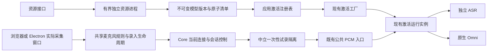

# 声纹实施：核心改动与审查边界

本次按采集修复、诊断预检、完整资源交付和激活恢复四个交付包实施。N.E.K.O 与 N.E.K.O.-PC 都从最新 main 建立独立 worktree；原工作区的已有改动保留。操作说明见 [声纹录入与语音激活修复](voice-readiness.md)。

## 核心改动、必要性与前后表现

| 改动 | 原行为及问题 | 实施后的行为 | 重点回归面 |
|---|---|---|---|
| `core/voice_readiness.py` 与中立的 `voice_input/preview.py` | 录入页无法证明关联主采集已停止，试录可能混入会话输入 | 实际采集窗口停止输入，后端退休并排空对应路径后发出一次性试录票据；公共 PCM 入口同时阻断其他生产者 | 停止、取消、超时、其他会话接管、JSON/二进制音频及排队输出 |
| `core/asr_runtime.py` 的小型组装与入口修改 | 缺少主输入和试录之间的统一隔离检查 | 复用原 ASR 和激活路由，仅增加隔离检查及目标会话控制入口 | 独立 ASR、原生 Omni、热切换、重放、队列与原生输出身份 |
| `voice_identity_service/resource_manager.py` 与服务公共入口 | 资源、采集质量和声纹匹配故障容易混为同一错误 | 资源准备和试录在正式录入前完成；有界独立进程执行模型准备及同一 DSP 链的质量检查 | 原生组件挂起、进程崩溃、取消、DSP 变化、45 秒录入时限和档案保护 |
| 激活工厂、应用注册表和唤醒资源发现 | 已安装缓存不能按启用偏好装配，资源错误可能被泛化 | 显式配置优先，启用后发现完整已校验缓存；已启用但资源异常保持阻断；资源修复更新工厂权威 | 权限与档案版本、准备失败、旧实例迟到及修复后重新准备 |
| 当前会话重试 | 不可用状态缺少目标明确的恢复入口 | 退休旧实例后重建；传输结果不确定的路径要求用户显式重启语音会话 | 不重投旧音频、不重用已退休 provider、输出失败和超时 |
| 资源修复后的声纹权威 | 资源加载成功不能证明已有档案和音频契约可用 | 刷新复核档案、模型身份、DSP 契约、运行模式与未完成的 DSP 切换；不满足时保持对应不可用原因 | 无档案、旧模型档案、降噪不匹配、运行关闭、切换未完成及启用偏好不变 |

声纹阈值、检查时机、48 kHz 单声道输入、16 kHz 后端链、三段参考加一段验证、45 秒总时限和档案格式均保持现有约定。新增正式录入请求字段是兼容扩展，用于核对已试录的 DSP 配置。

## 依赖与权威

模型包与偏好共用位于配置基础层的标准库文件锁；`main_logic` 不依赖应用入口，配置层不反向引用工具层。部署资源的发现、安装与发布属于应用服务外层，中立的 `voice_input` 仅保留运行契约与检测接口。全仓模块分层和 Core 包契约检查作为守门保留；`voice_readiness` 明确登记为 ASR bridge 的 owner 子模块。前端持续状态仅消费既有 `VOICE_SESSION_ACTIVATION_STATE`，恢复请求走既有 WebSocket 控制通道。IPC 只交换身份和操作结果，不传 PCM 或跨 partition 的设备编号。

## 新增资源的消费者

| 资源 | 发布、读取与清理边界 |
|---|---|
| 临时下载目录与标记 | 固定包安装器独占管理；固定来源、摘要、大小与解包白名单；中断后仅清理本功能明确拥有的临时目录 |
| `versions/<version>` | 完整校验和真实试加载后发布；运行实例继续使用原路径；不覆盖旧目录，最多三个版本并限制总占用 |
| `current.json`、`current.pending` | 原子替换的完整版本指针；缓存发现和后端激活读取同一规则；提交前取消或发布失败保留原指针；提交开始后的取消等待真实结果，`committed` 区分已发布与未发布；中断遗留的固定 pending 文件只在本功能的 OS 锁下处理 |
| `preference.pending`、偏好与锁 | 有界、串行、原子写入；下载不改启用偏好；不关联声纹档案保存 |
| 唤醒运行组件 | 固定源码与补丁构建，Windows x64 打包；冻结程序须通过真实模型加载检查后才可交付 |
| 修复指南、前端资源和测试 | 同源固定只读指南随冻结包交付；新增脚本由模板资产版本管理；八语缓存版本更新；Node 和 Electron 测试进入 CI |

缓存达到上限时停止安装并提示受控维护，避免删除仍在使用的旧版本。回退可以使用原显式模型路径，不改档案或启用偏好。

## 验证与实际限制

回归通过实际 WebSocket 入口和受控下游接收端验证独立 ASR／原生 Omni、JSON／二进制音频、等待／异常／试录期间的实际音频递交。Electron 验证使用实际模板、AudioWorklet、窗口、Session、桥接和更新面板；输入来自 Chromium 受控测试设备。

本机已用受控语音通过真实 CAM++、Silero 和 RNNoise 完成试录、三段参考加一段验证、成功保存及失败重录后的原档案保护。真实浏览器已验证资源准备和设备列表。该结果不替代实际物理麦克风、断插设备和不同声学环境的验收。

定稿后的联合 Python 回归为 1,939 项通过、4 项跳过；前端 Node 为 151 项通过，桌面采集控制为 18 项通过。三条实际 Electron 流程覆盖录入页面与 AudioWorklet、实际采集窗口和 Session 隔离、关于面板更新修复入口。八语提示、Node／Electron CI 入口、Ruff、异步阻塞和全仓模块分层检查均已核对。

新增模块按行覆盖率验收：Core 控制 90%、中立隔离 99%、唤醒资源发现 97%、错误白名单 100%、资源管理 85%、模型包交付 84%；前端共享采集 93.02%、试录与资源页面 84.46%、主会话状态与控制 83.86%。前端分支与函数覆盖低于行覆盖，Electron 验收未合并到这些百分比中。

桌面仓库全量测试仍有基线失败：6 项 unit、11 项 contract 失败在未修改的 `a4fe791` 基线也可复现。本次新增的采集、桥接和修复流程测试通过；不能将这些结果表述为桌面仓库全量测试全绿。

Windows 冻结安装包和定制唤醒组件的源码构建、安装、模型真实试加载及冻结程序检查已接入打包流水线。本机缺少该原生构建工具链，尚未生成或验收更新后的安装包，不能将源码测试结果视为冻结包已经可发布。

核心模块 review 应优先检查试录隔离的生产者权威、每个 await 后的身份校验、旧任务退休、资源原子发布，以及 ASR／Omni 两条真实递交路径。此合同跨两仓库，配套版本需要一起验收；分别回退时仍须保留门控和用户档案。

## 首轮审查核验

审查对象为 `533d2d5de`，只有事实成立且属于实施合同的问题进入修复。

本轮生产代码的联合回归为 2,225 项通过、4 项跳过，前端 Node 为 157 项通过，真实 Electron 页面通过。随后启动预算测试的 9 项回归通过：配置响应超过旧测试的三秒探针仍可在生产启动预算内创建新会话；强制等待旧 worker 物理退出的反证仍失败。该调整仅修正测试的因果判断，没有改生产 TTS、启动预算、容量或退休逻辑。

| 意见 | 核验与处理 |
|---|---|
| [试录代次必然失效](https://github.com/Project-N-E-K-O/N.E.K.O/pull/3282#discussion_r4171613153) | 误报；闭包读取更新后的操作代次，真实控制入口的成功试录已证明此路径可用 |
| [成功试录被重复释放](https://github.com/Project-N-E-K-O/N.E.K.O/pull/3282#discussion_r4171613155) | 成立；真实 Core、API 与两端前端协议复现，修复为绑定原 owner、限时限量的消费销账记录，旧销账不解除新试录 |
| [取消后发布模型](https://github.com/Project-N-E-K-O/N.E.K.O/pull/3282#discussion_r4171613157) | 成立；分离不可变版本准备与指针提交，取消返回实际发布结果并重新准备运行权威 |
| [取消检查仍显示就绪](https://github.com/Project-N-E-K-O/N.E.K.O/pull/3282#discussion_r4171613159) | 成立；就绪仅在刷新及操作、DSP 身份复核通过后发布 |
| [默认 home 解析异常](https://github.com/Project-N-E-K-O/N.E.K.O/pull/3282#discussion_r4171625614) | 成立；配置读取、资源解析与快照返回稳定的不可用原因，保持失败阻断 |
| [PowerShell 5.1 命令引号](https://github.com/Project-N-E-K-O/N.E.K.O/pull/3282#discussion_r4171625617) | 成立；检查命令改为读取既有版本常量，避免原生参数传递中的嵌套引号 |
| [Core owner 未注册](https://github.com/Project-N-E-K-O/N.E.K.O/pull/3282#discussion_r4171625619) | 成立；登记 ASR bridge 的控制 owner 子模块，保留 Core 结构检查 |
| [偏好进程五秒预算](https://github.com/Project-N-E-K-O/N.E.K.O/pull/3282#discussion_r4171625623) | 本机三次真实冷启动约 0.5 秒，未复现；保留可物理退休的有界独立进程，冻结包冷启动仍待验收 |
| [资源刷新绕过档案检查](https://github.com/Project-N-E-K-O/N.E.K.O/pull/3282#discussion_r4171625627) | 成立；补齐模型身份、档案和 DSP 契约、运行模式与未完成切换检查，保持档案和偏好不变 |
| [中立层依赖配置](https://github.com/Project-N-E-K-O/N.E.K.O/pull/3282#discussion_r4171625633) | 分层事实成立；资源实现迁到应用服务外层；拒绝配置反向导入领域实现的建议，保留双重分层守门 |
| [重试超时结果不确定](https://github.com/Project-N-E-K-O/N.E.K.O/pull/3282#discussion_r4171625637) | 成立；要求用户显式重启，阻断输入及迟到状态，旧重试不能修改新会话的控件或门控 |
| [管理窗口缺共享麦克风模块](https://github.com/Project-N-E-K-O/N.E.K.O/pull/3282#discussion_r4171625644) | 成立；桌面转发使用其自身操作编号来源，接住同步 IPC 异常并恢复菜单，仍由实际采集窗口打开录入 |

## 提交后刷新超时核验

| 意见 | 核验与处理 |
|---|---|
| [已提交资源的刷新超时原因](https://github.com/Project-N-E-K-O/N.E.K.O/pull/3282#discussion_r4171724770) | 成立；已发布模型包后的运行时刷新超时误报为资源准备超时。修复在刷新边界使用既有 `runtime_degraded` 权威原因，保留 `committed=true` 与已安装结果；实际提交、五秒刷新超时及并发取消证明旧版本保留、新指针不回滚，提交前工作进程超时反证仍报告 `resource_prepare_timeout` |

该条定向资源与真实 API 回归共 65 项通过，Ruff、异步阻塞、Core 契约及全仓分层守门通过。删除新增超时分类的突变版本会在真实已提交刷新超时测试中失败，实际得到旧错误码 `resource_prepare_timeout`，证明测试能够识别这次修复的行为差异。

前端资源控制器的 29 项回归通过，下载轮询与取消两条路径复用既有八语激活异常提示。实际控制器读取 `committed=true`、`installed=true` 的失败结果后，显示运行时不可用原因，刷新仍保留就绪模型并读取会话状态，不改启用偏好，也不误报取消。

## 联合协议测试的失败出口

[协议测试的异步拒绝](https://github.com/Project-N-E-K-O/N.E.K.O/pull/3282#discussion_r4171733566)成立，仅修复测试工具。RPC 拒绝与控制回调异常统一交给主测试失败出口；六秒 RPC 确认期限介于 Core 五秒清理预算与客户端八秒控制等待之间。错误 JSON、未知回执和管道关闭走同一失败出口，结束时释放读入监听与定时器。产品协议、会话预算及音频门控未修改。

六种真实子进程故障与四种真实 Core／API／两端 JS 联合场景共 10 项通过，控制与隔离联合回归 94 项通过。临时恢复旧 RPC 异常链后，拒绝与回调异常两项反证均失败；修复后的子进程自然退出为 1，携带主测试诊断，没有未处理的 Promise 拒绝。

本次追加修复的录入与资源前端回归共 106 项通过，实际 Electron 41.2.0 页面和 AudioWorklet 验证通过。前序提交 `2a52cdd` 的全量 Windows pytest 为 27,120 项通过、153 项跳过，全部 checks 已通过；这项结果对应前序提交，不替代追加提交的 CI。
